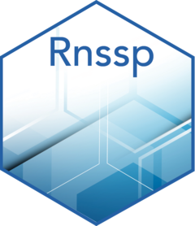

# Rnssp <a href='https://cdcgov.github.io/Rnssp'></a>

<!-- badges: start -->
[](https://github.com/cdcent/Rnssp/actions/workflows/check-standard.yaml)
[](https://github.com/CDCgov/Rnssp)
[](https://lifecycle.r-lib.org/articles/stages.html#stable)
[](https://zenodo.org/badge/latestdoi/369309753)
[](https://github.com/CDCgov/Rnssp)
<!-- badges: end -->

## Overview
The **Rnssp** R package is a catalog of data processing and analytics tools, templates, and functions commonly used across the National Syndromic Surveillance Program at the Centers for Disease Control and Prevention (CDC). Its goal is to improve code reproducibility, standardize and document reusable functions, facilitate the sharing of routine reports across the NSSP Community of Practice (CoP), and better engage the NSSP CoP.

## Installation

You can install the development version of `Rnssp` from GitHub:

```r
# install the Rnssp package
devtools::install_github("cdcgov/Rnssp")
```


## Usage

This is a basic example which shows you how to:

- use the `Rnssp` package to create an NSSP user profile
- and use the NSSP user profile to pull data from ESSENCE via the ESSENCE API


``` r
library(Rnssp)

## Creating a user profile (token)
myProfile <- create_token_profile()

## Creating a user profile (username and password)
myProfile <- create_profile()

## Inspect your `myProfile` confirming that username and password are completely hidden
myProfile

## JSON URL from ESSENCE API
url <- "https://essence.syndromicsurveillance.org/nssp_essence/api/alerts/regionSyndromeAlerts?end_date=31Jan2021&start_date=29Jan2021"

## Update Start and End dates in ESSENCE API URL
url <- change_dates(url, start_date = Sys.Date() - 30, end_date = Sys.Date())

## Pull Time Series Data from ESSENCE
api_data <- get_api_data(url) # or api_data <- myProfile$get_api_data(url)

## Inspect data object structure
names(api_data)

## Get a glimpse of the pulled dataset
glimpse(api_data$regionSyndromeAlerts) 
```

## Contributing to this project
Should you want to contribute to this project, submit a push request to this Github repository and consider submitting a request to be added as a developer to gazondekon@cdc.gov.

## Getting Help
If you encounter a clear bug, please consider emailing the author at gazondekon@cdc.gov and/or file an issue with a minimal reproducible example.

## Citing the `Rnssp` package
```tex
@software{Azondekon_Rnssp_A_Signature_2023,
  author = {Azondekon, Gbedegnon Roseric and Sheppard, Michael},
  license = {Apache License (>= 2)},
  month = {2},
  title = {{Rnssp: A Signature R package for the National Syndromic Surveillance Program (NSSP)}},
  url = {https://github.com/CDCgov/Rnssp},
  version = {0.2.0},
  year = {2023}
}
```

## Public Domain Standard Notice
This repository constitutes a work of the United States Government and is not
subject to domestic copyright protection under 17 USC ? 105. This repository is in
the public domain within the United States, and copyright and related rights in
the work worldwide are waived through the [CC0 1.0 Universal public domain dedication](https://creativecommons.org/publicdomain/zero/1.0/).
All contributions to this repository will be released under the CC0 dedication. By
submitting a pull request you are agreeing to comply with this waiver of
copyright interest.

## License Standard Notice
The repository utilizes code licensed under the terms of the Apache Software
License and therefore is licensed under ASL v2 or later.

This source code in this repository is free: you can redistribute it and/or modify it under
the terms of the Apache Software License version 2, or (at your option) any
later version.

This source code in this repository is distributed in the hope that it will be useful, but WITHOUT ANY
WARRANTY; without even the implied warranty of MERCHANTABILITY or FITNESS FOR A
PARTICULAR PURPOSE. See the Apache Software License for more details.

You should have received a copy of the Apache Software License along with this
program. If not, see http://www.apache.org/licenses/LICENSE-2.0.html

The source code forked from other open source projects will inherit its license.

## Privacy Standard Notice
This repository contains only non-sensitive, publicly available data and
information. All material and community participation is covered by the
[Disclaimer](https://github.com/CDCgov/template/blob/master/DISCLAIMER.md)
and [Code of Conduct](https://github.com/CDCgov/template/blob/master/code-of-conduct.md).
For more information about CDC's privacy policy, please visit [http://www.cdc.gov/other/privacy.html](https://www.cdc.gov/other/privacy.html).

## Contributing Standard Notice
Anyone is encouraged to contribute to the repository by [forking](https://help.github.com/articles/fork-a-repo)
and submitting a pull request. (If you are new to GitHub, you might start with a
[basic tutorial](https://help.github.com/articles/set-up-git).) By contributing
to this project, you grant a world-wide, royalty-free, perpetual, irrevocable,
non-exclusive, transferable license to all users under the terms of the
[Apache Software License v2](http://www.apache.org/licenses/LICENSE-2.0.html) or
later.

All comments, messages, pull requests, and other submissions received through
CDC including this GitHub page may be subject to applicable federal law, including but not limited to the Federal Records Act, and may be archived. Learn more at [http://www.cdc.gov/other/privacy.html](http://www.cdc.gov/other/privacy.html).

## Records Management Standard Notice
This repository is not a source of government records, but is a copy to increase
collaboration and collaborative potential. All government records will be
published through the [CDC web site](http://www.cdc.gov).
