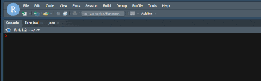

```{r global_options, include = FALSE}
knitr::opts_chunk$set(
  message = FALSE,
  warning = FALSE,
  comment = "#>",
  collapse = TRUE,
  cache = FALSE
)
```


<style>
img {
  max-width: 700px;
}
</style>


## Launch the addin {-}

In RStudio, you can use the *Addins* menu : 


## Create a User Profile with the GUI {-}

Users may create and save a profile via the *Create User Profile (GUI)* addin menu as shown below:


Or in the R console :

```{r, eval=FALSE}
Rnssp:::create_user_profile_gui()
```


## Generate a Skeleton to create a User Profile {-}

Alternatively, users may generate a code skeleton in the R console from the *Create User Profile (code skeleton)* addin as demonstrated below:


Or in the R console :

```{r, eval=FALSE}
Rnssp:::create_user_profile()
```


## Listing Available Rnssp templates {-}

Users may check the list of all the currently available [Rnssp R Markdown templates](https://cdcgov.github.io/Rnssp-rmd-templates) with the *List Rnssp Templates* addin:



Or in the R console :

```{r, eval=FALSE}
Rnssp::list_templates()
```


## Add/Update Rnssp Templates {-}

A unique feature of the `Rnssp` package is the ability to add R Markdown templates dynamically to an existing installation of the package. The National Syndromic Surveillance Program (NSSP), in collaboration with its Community of Practice (CoP), develops various R Markdown templates which can be dynamically added or updated via with the *Add/Update Rnssp Templates* addin:


Or in the R console :

```{r, eval=FALSE}
Rnssp:::add_rmd_template_gui()
```


## Remove Rnssp Templates {-}

When one or more Rnssp templates are no longer needed, they can be removed via the *Remove Rnssp Templates* addin:


Or in the R console :

```{r, eval=FALSE}
Rnssp:::remove_rmd_template_gui()
```


## Accessing Package and Templates Documentations {-}

The *Rnssp Templates Documentation* and the *Rnssp Documentation* addins are provided to allow users to easily access respectively, the Rnssp R Markdown templates and the Rnssp package online documentation.


### Rnssp R Markdown Templates Documentation Addin {-}


### Rnssp Package Documentation {-}


